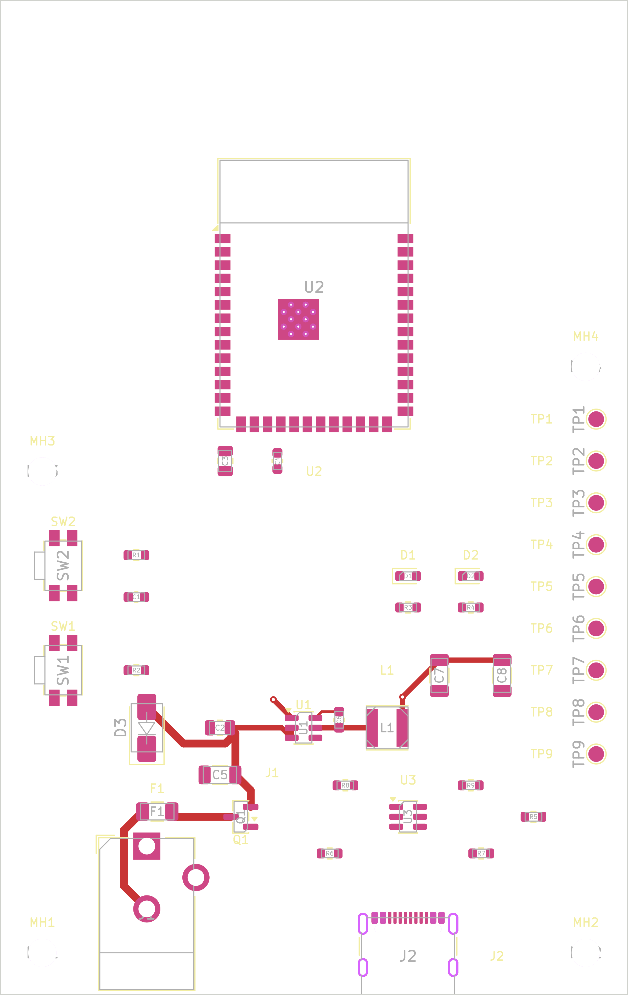
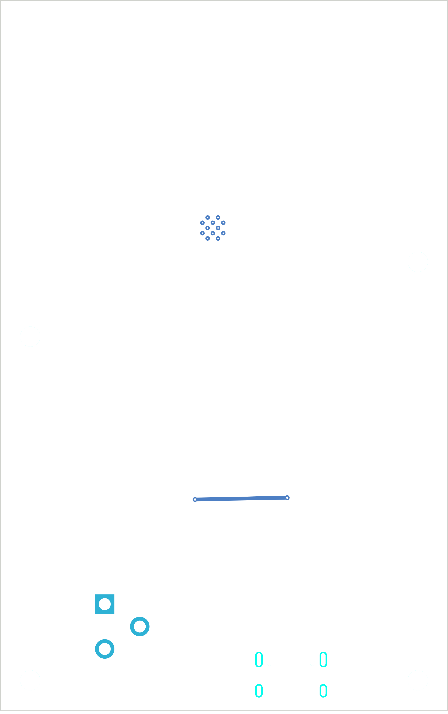
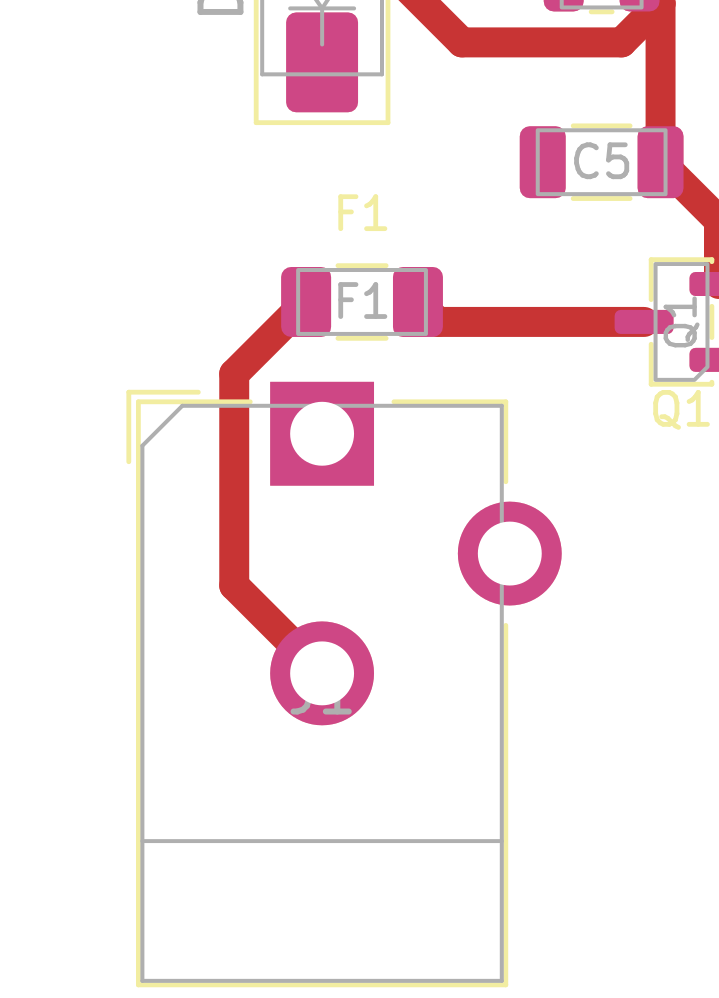
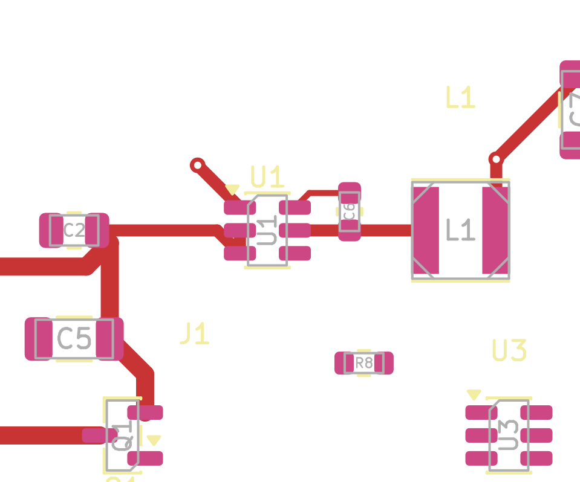
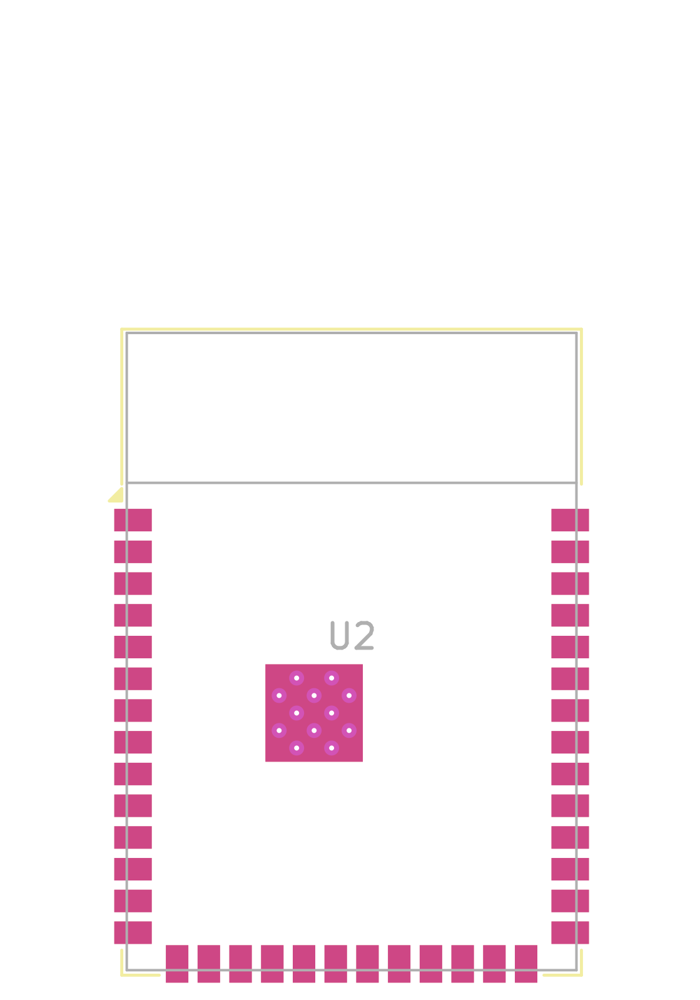
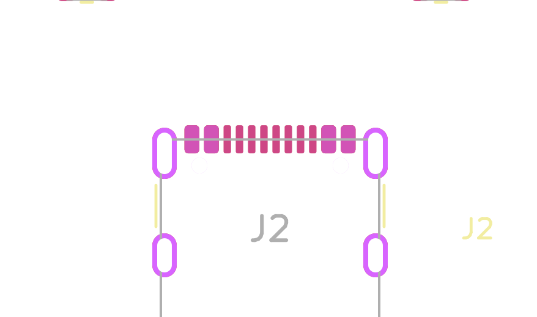
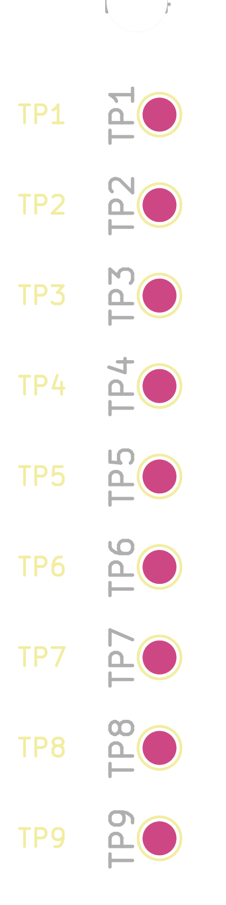
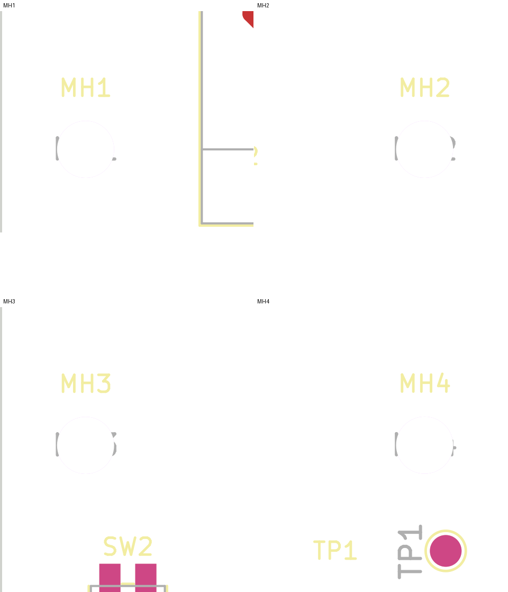
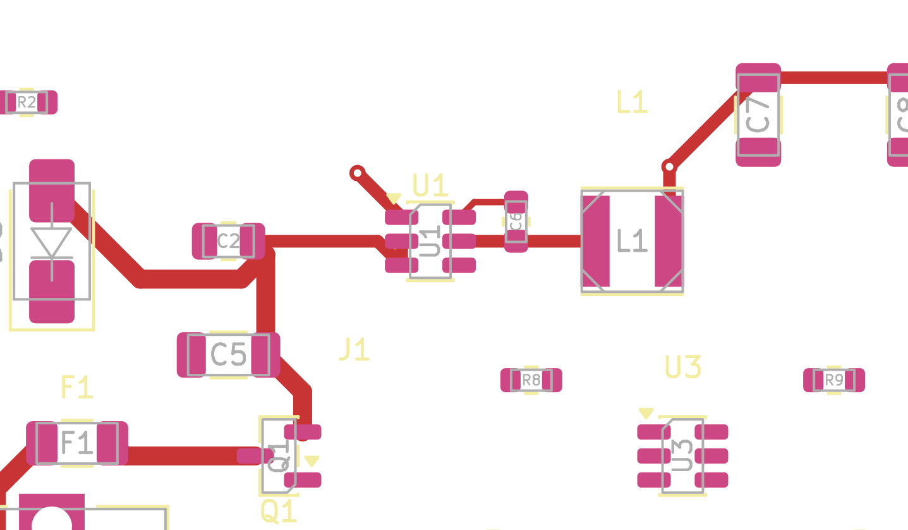

# Live PCB Truth Audit Review

Date: `2026-05-07`

Status: `VISUAL_EVIDENCE_CAPTURED`

Overall visual result: `PLACEMENT_EXISTS_NEEDS_REVIEW`

## Full Board

Top:

Observation:

- real board outline exists
- placement exists
- routed copper exists in the lower power/regulator area

Bottom:

Observation:

- bottom-side routed content is minimal
- a bottom `+3V3` link is visible
- mounting holes and lower connector mechanical features are visible

## Power Input Area

Observation:

- `J1`, `F1`, and `Q1` are physically present
- real copper already connects the lower input path

## Regulator / Power Path

Observation:

- `U1`, `L1`, `C2`, `C5`, `C6`, `C7`, and `C8` are placed
- live routed copper exists through the buck/local `+3V3` cluster

## ESP32 Module And Antenna Keepout

Observation:

- `U2` is near the top edge
- the top-edge side is visually clear of nearby component crowding

## USB-C Connector

Observation:

- `J2` is on the bottom edge
- USB routing is not yet present

## Test Pad Row

Observation:

- `TP1..TP9` form a clean vertical right-edge service row

## Mounting Holes

Observation:

- four mounting-hole footprints are present on the live board

## Existing Routed Traces

Top-side routed traces:

Bottom-side routed traces:

Observation:

- routed copper already exists on the board
- routing is partial, not complete
