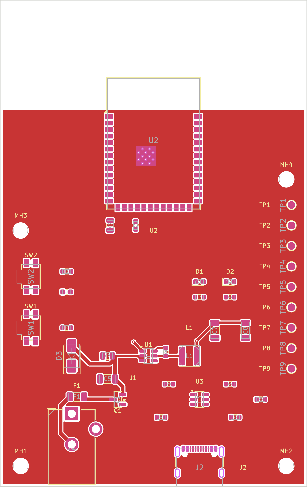
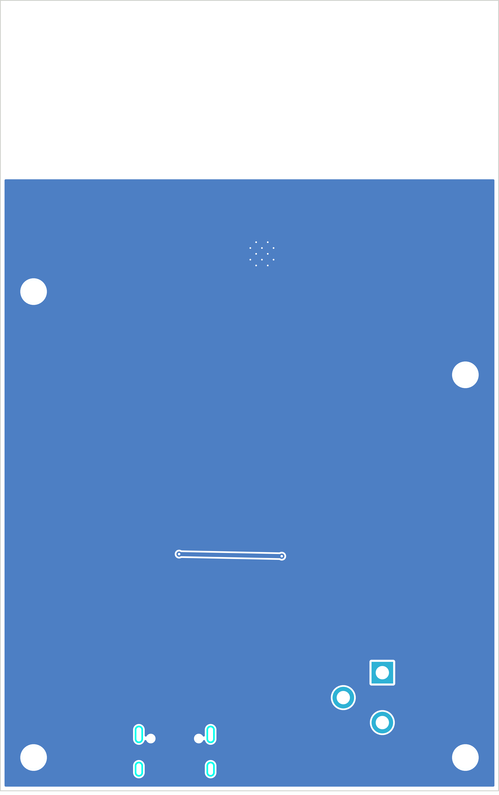
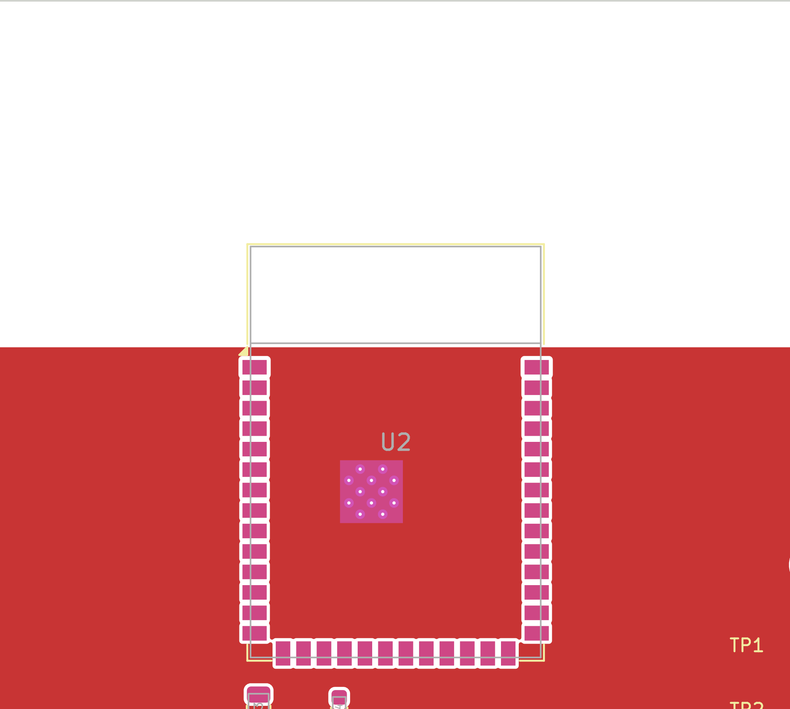
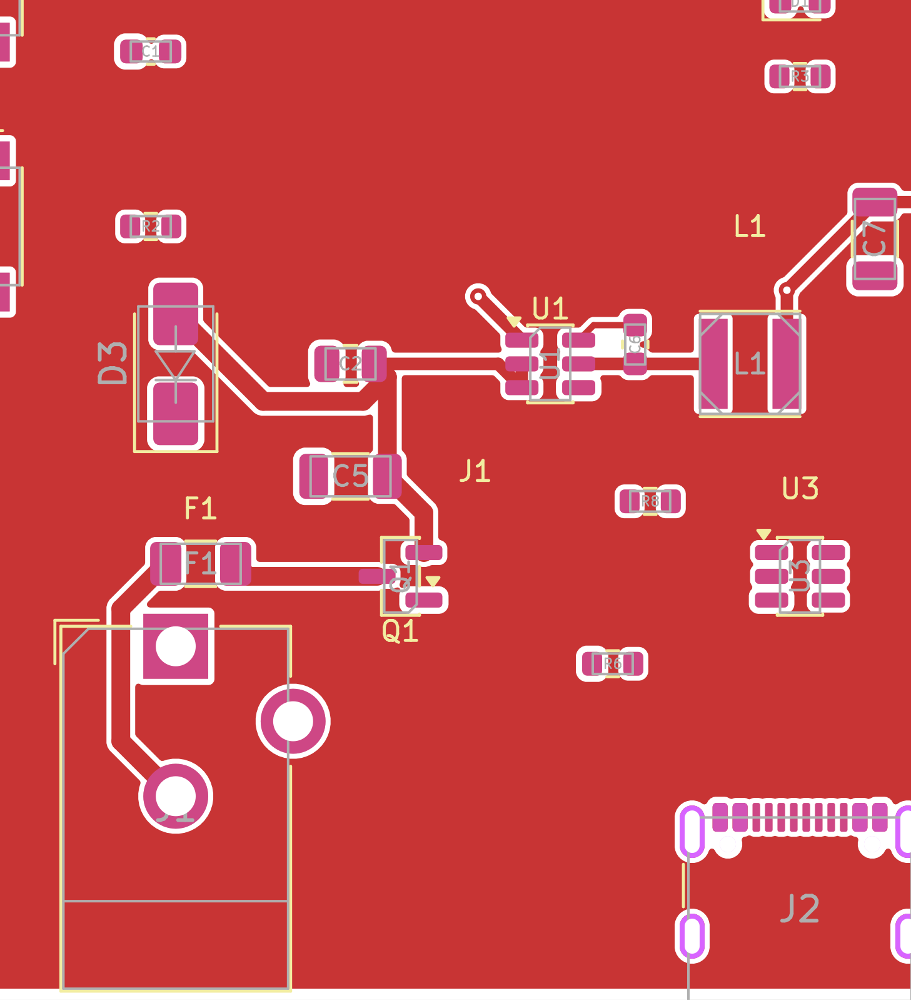
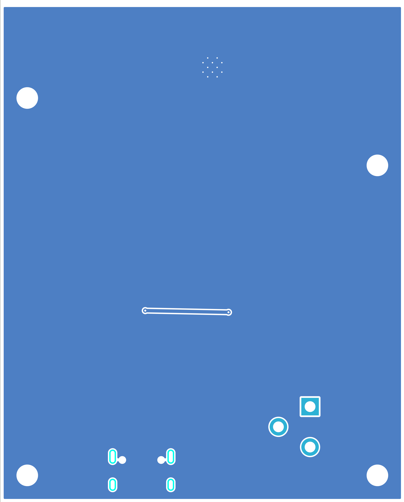
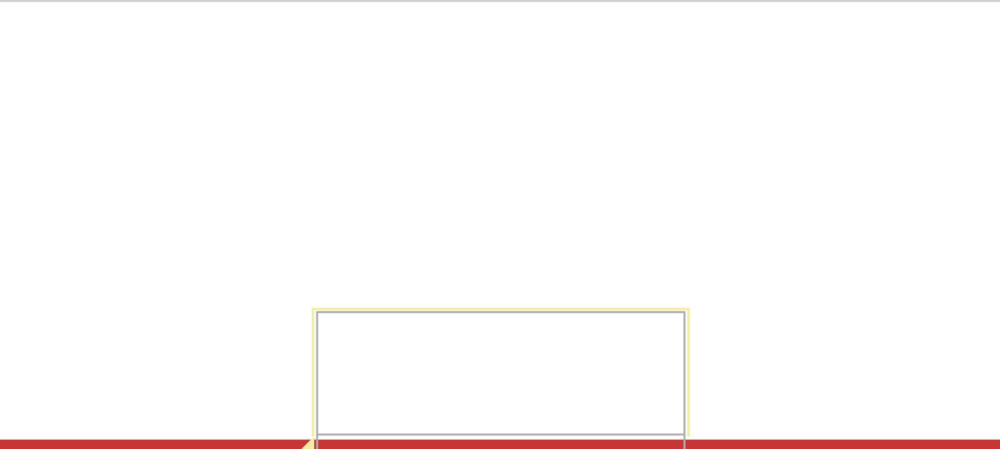
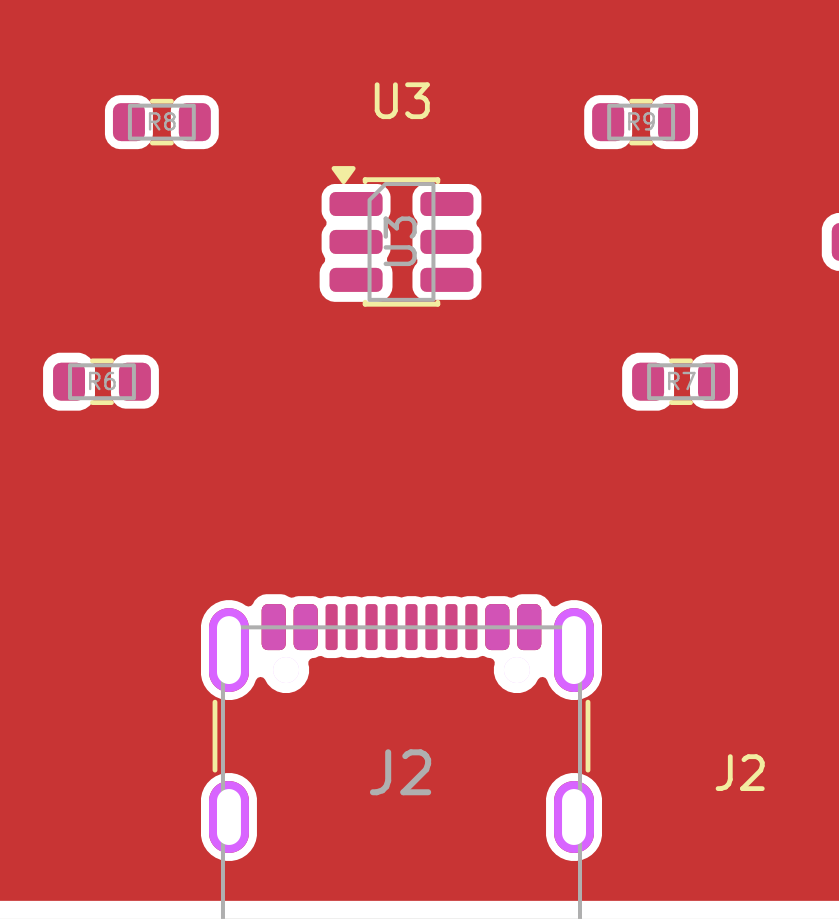
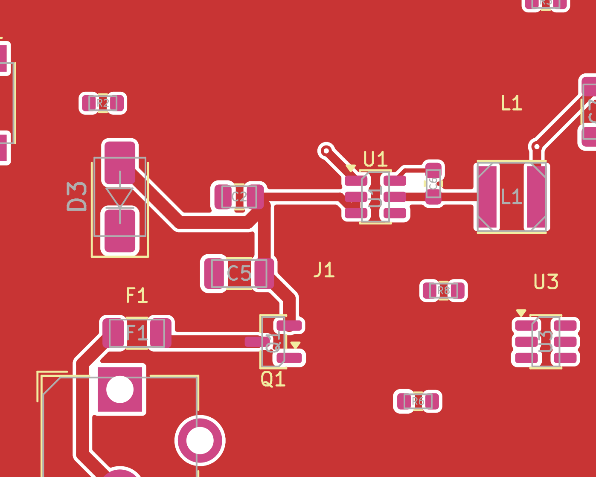

# REAL_PCB_REPAIR_PASS_1_REVIEW

Date: `2026-05-08`

Visual status: `REPAIRED_BOARD_NOT_READY_FOR_ROUTING`

## Full Board

Top view:

Bottom view:

## U2

- `U2` remains near the top edge.
- The repair did not distort the thermal-via array geometry.
- Top copper now starts below the antenna strip instead of leaving the entire board zone-free.

## Power Path

- Existing power-area traces remain present and visually intact.
- No blind trace move was applied in this pass.
- The new top-zone fill now surrounds the routed power area.

## GND Zones

- `GND` pours now exist on both copper layers.
- The bottom layer shows broad continuous fill across the routed board area.

## ESP32 Antenna Keepout

- The top-edge antenna strip remains clear of poured copper.
- The new `F.Cu` zone begins below the keepout boundary.

## USB Area

- The USB-C connector area remains mechanically unchanged in this pass.
- Routing in this area is still incomplete.

## Existing Repaired / Accepted Traces

- Existing routed copper remains visible in the power/regulator section.
- These traces were accepted as-is for this pass because no new hard fault justified a blind geometry rewrite.
